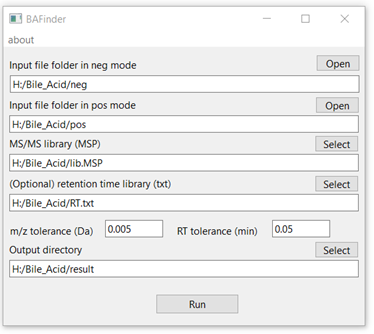

## BAFinder

### News: BAFinder 2.0 is comming!
For internal validation, please go to the following link to download software and test data:  
https://github.com/BAFinder/bafinder.github.io/tree/BAFinder-2.0  

### Introduction
BAFinder is a program developed for the unknown bile acid identification from LC-MS/MS data in both positive and negative modes. It was developed in Java (jdk 15.0.1) with a graphical user interface (GUI) using the Open Source IDE Eclipse. BAFinder takes the alignment and peak list generated from XCMS (csv) and MS/MS spectra (MGF), searches them against a MS/MS reference library (MSP), a build-in characteristic feature (e.g. product ion or neutral loss) query list and an optional retention time library (txt) within user-defined m/z and RT tolerance, and exported the annotation summary (csv), processing details (csv) and representative MS/MS spectra (MGF) into an output folder.

### Download Link

BAFinder software  
If you don't want to install java, please download the packaged program for <a href="./software/BAFinder_windows64.zip" download>Windows64</a> or <a href="./software/BAFinder_macosx.zip" download>macOS</a> system.(~70 MB)   
If you already have jre 15.0.1 or later installed, or don't mind installing java on your system, please download the jar file for <a href="./software/BAFinder_win.jar" download>Windows</a> or <a href="./software/BAFinder_macosx.jar" download>macOS</a> system. (~20 MB).

The following resources are also available for download:  
User Manual <a href="./doc/assets/BAFinder User Manual v1.0.pdf" download>(PDF)</a>   
MS/MS library for bile acids (<a href="./data/MSMS_library.msp" download>MSP</a>, including 84 bile acids, developed using QE-HFX in positive ESI mode at NCE 45 and negative ESI mode at NCE 60)  
Test data (<a href="./data/Test data.zip" download>zip</a>, example for input and output files of a human plasma dataset, with library included)

### Citation

If you use BAFinder software or libraries in your published work, please cite the BAFinder paper:  
BAFinder: A Software for Unknown Bile Acid Identification Using Accurate Mass LC-MS/MS in Positive and Negative Modes  
DOI:10.1021/acs.analchem.1c05648

### Contact

If you have any question about BAFinder, please contact Dr. Yan Ma (mayan@nibs.ac.cn).

